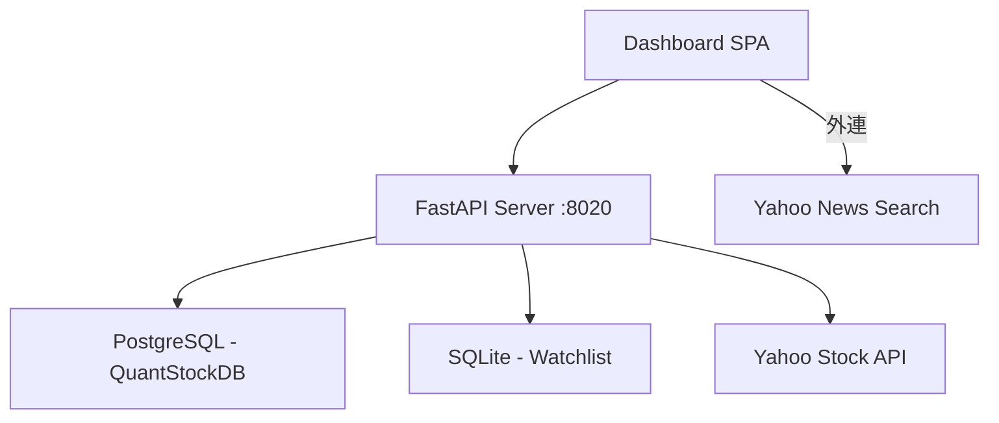

# ProTech-Stock-News Dashboard — Implementation Plan

## 系統概述
個股技術分析 + 基本面 Dashboard。整合 ProTech-QuantStockDB (PostgreSQL) K 線、營收、獲利資料，結合 Yahoo 社群爆紅榜與新聞外連。

## 架構



## 功能清單

| 功能 | 說明 |
|------|------|
| K 線圖 | 日/週/月線切換，天數可調 |
| MA 均線 | 最多 5 條自訂（天數+開關） |
| VOL / MACD | 互斥子圖（radio 切換） |
| 年度營收走勢 | 折線圖（月營收按年加總） |
| 累計淨利 | 折線圖（季報營收×稅後淨利率） |
| 自選股 | SQLite 持久化，CRUD |
| 社群爆紅榜 | Yahoo 最多瀏覽/激增/熱門搜尋 |
| 個股新聞 | 外連 Yahoo News 搜尋 |
| 設定面板 | 週期/天數/MA/子圖 統一設定 |

## API Endpoints

| Method | Path | 說明 |
|--------|------|------|
| GET | `/api/stocks` | 全部股票清單 |
| GET | `/api/stock/{code}/kline?period=&days=` | K 線 (daily/weekly/monthly) |
| GET | `/api/stock/{code}/revenue` | 年度營收 |
| GET | `/api/stock/{code}/eps` | 累計淨利 |
| GET | `/api/hot-stocks?type=` | 社群爆紅榜 |
| GET | `/api/watchlist` | 取得自選股 |
| POST | `/api/watchlist/{code}?name=` | 加入自選 |
| DELETE | `/api/watchlist/{code}` | 移除自選 |

## 專案結構

```
src/
├── core/
│   ├── database.py    # SQLite (watchlist only)
│   └── pg_client.py   # PostgreSQL queries
├── services/
│   └── yahoo_service.py  # Hot stocks
├── server.py          # FastAPI
└── templates/
    └── index.html     # Dashboard SPA
```

## 資料來源

- **PostgreSQL** (blog.softsnail.com:2432/twsestock)
  - `stock_basic` — 1964 檔股票
  - `daily_kline` — 日K線 2023~至今
  - `monthly_revenue` / `monthly_revenue_tpex` — 月營收
  - `quarterly_profit` — 季獲利
- **Yahoo Stock** — 社群爆紅榜即時抓取
- **SQLite** — 自選股本地儲存
