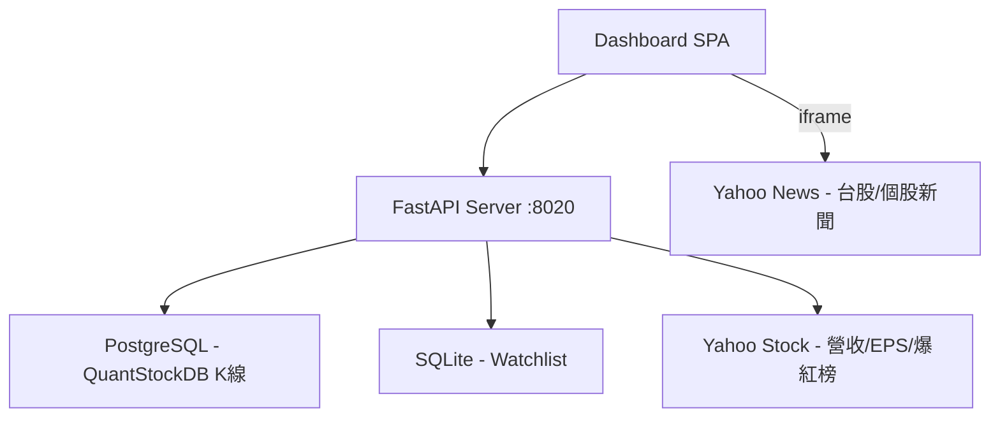

# ProTech-Stock-News Dashboard — Implementation Plan

## 系統概述
個股技術分析 + 基本面 Dashboard。整合 ProTech-QuantStockDB (PostgreSQL) K 線資料，Yahoo Stock 營收/EPS/社群爆紅榜/新聞。

## 架構



## 功能清單

| 功能 | 說明 |
|------|------|
| K 線圖 | 日/週/月線切換，天數可調（控制項在圖表上方） |
| MA 均線 | 最多 5 條自訂天數，無橫線無價格標籤 |
| VOL / MACD | 互斥子圖（radio 切換，設定面板中） |
| 年度營收走勢 | 折線圖（Yahoo 月營收按年加總） |
| 累計 EPS | 折線圖（Yahoo 季 EPS 按年累計） |
| 自選股 | SQLite 持久化，加入/移除/列表點擊 |
| 社群爆紅榜 | Yahoo 最多瀏覽/瀏覽激增/熱門搜尋 |
| 個股新聞 | iframe 嵌入 Yahoo News 搜尋 |
| 台股新聞 | 預設顯示 Yahoo 台股盤勢新聞 |
| 設定面板 | ⚙ 按鈕展開：MA 自訂 + VOL/MACD 切換 + 自選股列表 |

## API Endpoints

| Method | Path | 說明 |
|--------|------|------|
| GET | `/api/stocks` | 全部股票清單 |
| GET | `/api/stock/{code}/kline?period=&days=` | K 線 (daily/weekly/monthly) |
| GET | `/api/stock/{code}/revenue` | 年度營收（Yahoo 抓取） |
| GET | `/api/stock/{code}/eps` | 累計 EPS（Yahoo 抓取） |
| GET | `/api/hot-stocks?type=` | 社群爆紅榜 |
| GET | `/api/watchlist` | 取得自選股 |
| POST | `/api/watchlist/{code}?name=` | 加入自選 |
| DELETE | `/api/watchlist/{code}` | 移除自選 |

## 專案結構

```
src/
├── core/
│   ├── database.py      # SQLite (watchlist)
│   └── pg_client.py     # PostgreSQL (kline: daily/weekly/monthly)
├── services/
│   └── yahoo_service.py # Hot stocks + Revenue + EPS
├── server.py            # FastAPI
└── templates/
    └── index.html       # Dashboard SPA
```

## 資料來源

- **PostgreSQL** (ProTech-QuantStockDB) — K 線（日/週/月聚合）
- **Yahoo Stock** — 社群爆紅榜、年度營收、累計 EPS
- **Yahoo News** — 台股盤勢新聞（iframe）、個股新聞搜尋（iframe）
- **SQLite** — 自選股本地儲存
