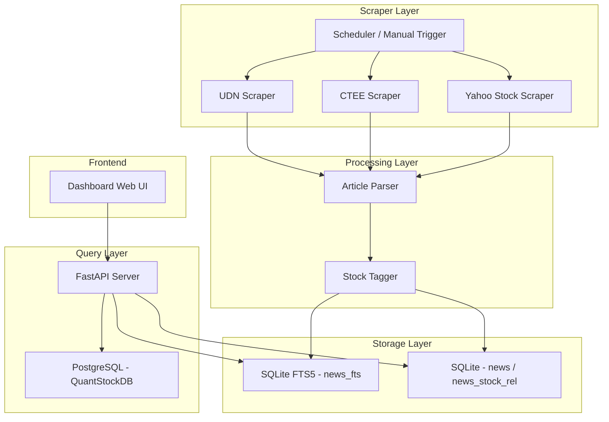

# Implementation Plan - ProTech-Stock-News 個股新聞爬蟲與整合系統

## Problem Statement
建立一個獨立專案，從**經濟日報** (money.udn.com)、**工商時報** (ctee.com.tw) 和 **Yahoo 股市** (tw.stock.yahoo.com) 爬取最新全站新聞，存入 SQLite FTS5 資料庫。支援按個股搜尋相關新聞，並融合 ProTech-QuantStockDB (PostgreSQL) 的歷史 K 線資料，透過 Dashboard 展示個股新聞 + K 線圖。

## Requirements
1. 爬取經濟日報、工商時報、Yahoo 股市全站最新新聞
2. 支援定時排程 + 手動觸發
3. 自動提取新聞中提到的股票代號/名稱，建立新聞-個股關聯
4. FTS5 全文搜尋作為補充搜尋方式
5. 透過 API 連線 PostgreSQL 讀取 K 線資料
6. Dashboard 首頁顯示最新新聞、熱門個股，點入後顯示新聞 + K 線圖
7. 非 AI fallback path

## Background
- **經濟日報** (money.udn.com)：新聞列表可用 HTML 抓取，URL 結構為 `/money/cate/{cate_id}`，分類包含證券(5607)、產業(5612)等
- **工商時報** (ctee.com.tw)：使用 Cloudflare 保護（返回 403），需使用 cloudscraper 或 Playwright 繞過
- **Yahoo 股市** (tw.stock.yahoo.com)：新聞分類明確（台股盤勢、ETF、美股、陸港股等），URL 結構為 `/news`，頁面為 SSR + hydration，可直接用 requests + BeautifulSoup 抓取
- **ProTech-QuantStockDB**：PostgreSQL (blog.softsnail.com:2432, db: twsestock)，包含 `stock_basic`（約 1964 檔）和 `daily_kline`（2023~至今）

## Coding Conventions
- **Structure**: Core logic in `src/core/`, high-level services in `src/services/`
- **Language**: Technical explanations in **Traditional Chinese**
- **Code**: All code elements (variables, functions, comments) in **English**
- **Fallback**: Always provide a non-AI fallback path for data processing

## Project Structure
```
ProTech-Stock-News-20260603/
├── docs/
│   └── implementation-plan.md
├── src/
│   ├── core/
│   │   ├── __init__.py
│   │   ├── database.py
│   │   ├── scraper.py
│   │   ├── stock_tagger.py
│   │   └── pg_client.py
│   ├── services/
│   │   ├── __init__.py
│   │   ├── udn_service.py
│   │   ├── ctee_service.py
│   │   ├── yahoo_service.py
│   │   ├── news_service.py
│   │   └── scheduler.py
│   ├── __init__.py
│   ├── server.py
│   └── templates/
│       └── index.html
├── data/
│   └── news.db
├── tests/
├── requirements.txt
└── README.md
```

## Architecture Diagram


## Task Breakdown

### Task 1: 專案骨架與資料庫初始化
- 建立 `requirements.txt`
- `src/core/database.py`：news 表、news_stock_rel 表、FTS5 虛擬表 news_fts

### Task 2: Base Scraper 與經濟日報爬蟲
- `src/core/scraper.py`：BaseScraper (rate-limit, retry, User-Agent)
- `src/services/udn_service.py`：fetch_news_list, fetch_article, scrape_all

### Task 3: 工商時報爬蟲
- `src/services/ctee_service.py`：cloudscraper 繞過 Cloudflare

### Task 4: Yahoo 股市爬蟲
- `src/services/yahoo_service.py`：fetch_news_list, fetch_article, scrape_all

### Task 5: Stock Tagger 個股辨識
- `src/core/stock_tagger.py`：regex 比對股票代號/名稱
- `src/core/pg_client.py`：PostgreSQL 連線

### Task 6: FastAPI Server 與新聞查詢 API
- `src/services/news_service.py`：search_news, get_stock_news, get_latest_news
- `src/server.py`：RESTful API endpoints

### Task 7: 排程器
- `src/services/scheduler.py`：APScheduler 每日 08:00/12:00/18:00

### Task 8: Dashboard Web UI
- `src/templates/index.html`：lightweight-charts K線圖 + 新聞列表
