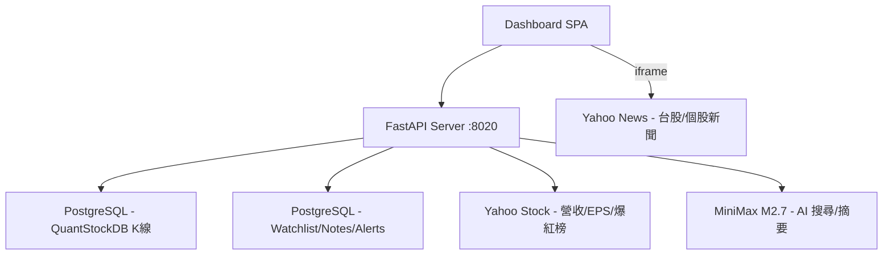

# ProTech-Stock-News Dashboard — 開發記錄

---

## 一、系統概述

個股技術分析 + 基本面 Dashboard。整合 ProTech-QuantStockDB (PostgreSQL) K 線資料，Yahoo Stock 營收/EPS/社群爆紅榜/新聞。

### 架構



### 專案結構

```
src/
├── core/
│   ├── database.py      # PostgreSQL (watchlist, notes, alerts, trades)
│   └── pg_client.py     # PostgreSQL (kline: daily/weekly/monthly)
├── services/
│   ├── yahoo_service.py    # Hot stocks + Revenue + Dividend + Rank
│   ├── semantic_search.py  # AI 搜尋 + 問答 (MiniMax M2.7)
│   ├── news_digest.py      # 週報摘要生成
│   ├── alert_engine.py     # 警示引擎
│   ├── backtest_engine.py  # 回測引擎
│   ├── realtime_quote.py   # 即時報價
│   ├── us_index_service.py # 美股指數
│   ├── image_analysis.py   # 圖片 OCR + AI 分析
│   └── telegram_service.py # Telegram 通知
├── server.py            # FastAPI
└── templates/
    └── index.html       # Dashboard SPA
```

---

## 二、已完成功能

| 功能 | 說明 |
|------|------|
| K 線圖 | 日/週/月線切換，天數可調 |
| MA 均線 | 最多 5 條自訂天數，MA 扣抵標記 |
| VOL / MACD | 互斥子圖切換 |
| 年度營收走勢 | 折線圖 |
| 歷年股利 | 柱狀圖 |
| 自選股 | 加入/移除/分組管理/▲▼ 快速切換 |
| 備註 | 獨立浮動視窗，文字+圖檔+截圖，可拖曳 |
| 警示通知 | 多條件、toast+Browser+Telegram |
| 回測 | 多條件策略模擬、K 線標記買賣點、損益統計 |
| 美股指數 | 道瓊/那斯達克/費城半導體 K 線圖 |
| 社群爆紅榜 | Yahoo 最多瀏覽/瀏覽激增/熱門搜尋 |
| 漲跌幅排行 | 上市/上櫃 漲幅/跌幅排行 |
| 個股新聞 | 外連 Yahoo News |
| AI 新聞搜尋 | MiniMax M2.7 語意搜尋 + 問答 |
| 週報摘要 | 自動生成每週新聞重點 |
| 圖片分析 | OCR + AI 辨識圖片內容 |

### API Endpoints

| Method | Path | 說明 |
|--------|------|------|
| GET | `/api/stocks` | 股票清單 |
| GET | `/api/stock/{code}/kline?period=&days=` | K 線資料 |
| GET | `/api/stock/{code}/revenue` | 年度營收 |
| GET | `/api/stock/{code}/dividend` | 歷年股利 |
| GET | `/api/hot-stocks?type=` | 社群爆紅榜 |
| GET | `/api/rank?direction=&market=` | 漲跌幅排行 |
| GET | `/api/watchlist` | 自選股清單 |
| POST | `/api/watchlist/{code}?name=` | 加入自選 |
| DELETE | `/api/watchlist/{code}` | 移除自選 |
| GET | `/api/alerts` | 警示條件列表 |
| POST | `/api/alerts` | 新增警示 |
| PUT | `/api/alerts/{id}` | 修改警示 |
| DELETE | `/api/alerts/{id}` | 刪除警示 |
| GET | `/api/alerts/settings` | 警示全域設定 |
| PUT | `/api/alerts/settings` | 更新警示設定 |
| POST | `/api/backtest` | 執行回測 |
| GET | `/api/usindex/{symbol}/kline?period=&days=` | 美股指數 K 線 |
| GET | `/api/notes/ask?q=` | AI 新聞問答 |
| GET | `/api/notes/search?q=` | AI 新聞搜尋 |

### 資料來源

- **PostgreSQL** (ProTech-QuantStockDB) — K 線、營收、獲利、自選股、交易記錄、備註、餘額、排行榜、警示、美股指數
- **Yahoo Stock** — 社群爆紅榜、漲跌幅排行
- **Yahoo Finance API** — 美股指數歷史資料
- **MiniMax M2.7** — AI 語意搜尋、新聞問答、週報摘要、圖片分析

---

## 三、待開發：AI 分析 K 線

> 討論日期：2026-07-30

### 3.1 K 線分析方案比較

| 方案 | 做法 | 優點 | 缺點 |
|------|------|------|------|
| A | 程式算指標 → 摘要送 LLM | 省 token、快、穩定 | 要寫指標邏輯 |
| B | 原始 OHLCV 直接送 LLM | 最簡單 | token 大、判斷易錯 |
| **C（✅）** | **混合：程式算指標 + 偵測型態 + LLM 綜合** | **兼顧精確與自然語言** | 開發量中等 |
| D | K 線圖渲染圖片 → 多模態 AI | 接近人類 | 費用高、模型限制 |

**決定採用方案 C（混合式）**

### 3.2 前端整合

- K 線圖區域新增「🤖 AI 技術分析」按鈕，點擊自動分析當前股票
- 分析結果自動寫入 `_conversation_history`
- 使用者可在現有「AI 搜尋」框接著追問（技術 + 新聞交叉對話）

### 3.3 分析結果儲存

- **自動存入 `watchlist_notes`**（stock_code + news_date + title:「🤖 AI 技術分析」）
- 不好的可**編輯**或**刪除**（已有 API）
- 修正後的版本成為 AI 下次的參考依據

### 3.4 「訓練」AI 方案與優先順序

| 優先級 | 方案 | 說明 | 難度 | 效果 |
|--------|------|------|------|------|
| 🥇 | 累積 + 編輯 | 歷史分析存 DB，使用者修正，AI 參考修正版 | 低 | 高 |
| 🥈 | 個人風格 Prompt | 使用者設定偏好（順勢/逆勢、指標權重、停損停利），自動帶入 | 低 | 中高 |
| 🥉 | 結果驗證標記 | 分析後標記 ✅/❌，prompt 帶入歷史正確率 | 中 | 高 |
| 4 | Few-shot 範例庫 | 精選優質分析作為 prompt 範例 | 中 | 中高 |
| 5 | 向量搜尋 RAG | embedding 語意搜尋 + 跨股票關聯 | 中高 | 中 |
| 6 | 多模型交叉驗證 | 多方/空方/裁判角色，正反觀點 | 低 | 中 |

### 3.5 技術實作規劃

1. 新增 `src/services/kline_analysis.py` — 技術指標計算 + K 線型態辨識
2. 新增 API：`POST /api/stock/{code}/ai-analysis?period=daily&days=120`
3. 分析結果自動存入 `watchlist_notes`
4. 分析結果同時寫入 `_conversation_history` 供追問
5. 前端 K 線圖工具列加「🤖 AI 技術分析」按鈕
6. 前端顯示分析結果，可編輯/刪除

---

## 四、全市場掃描 + 產業分類 + 跨股票 AI 分析

> 討論日期：2026-07-30

### 4.1 三大功能

| 功能 | 說明 | 資料來源 | 介面 |
|------|------|----------|------|
| A. 跨股票問答 | 「RSI<30 的股票有哪些？」 | `daily_indicators` 篩選 → LLM | AI 搜尋框 |
| B. 相關股比較 | AI 分析時自動帶入同產業股 | `daily_indicators` + 產業分類 | AI 分析自動帶入 |
| C. 全市場掃描 | 多條件篩選（可動態新增/修改） | `daily_indicators` 條件查詢 | 新增篩選器 UI |

### 4.2 架構設計

```
每日 18:00 排程（僅交易日執行）
  → is_trading_day()：查 DB 今天有無 K 線資料
  → 批次撈全市場 K 線 → 計算指標 → 存入 daily_indicators 表
  → A/B/C 所有查詢從 daily_indicators 秒回
```

### 4.3 daily_indicators 表設計

```sql
daily_indicators (
  stock_code TEXT,
  date DATE,
  close FLOAT,
  change_pct FLOAT,
  ma5 FLOAT, ma10 FLOAT, ma20 FLOAT, ma60 FLOAT,
  ma5_dir TEXT, ma10_dir TEXT, ma20_dir TEXT, ma60_dir TEXT,
  ma_arrangement TEXT,  -- 多頭/空頭/糾結
  macd_dif FLOAT, macd_signal FLOAT, macd_histogram FLOAT,
  rsi14 FLOAT,
  boll_upper FLOAT, boll_middle FLOAT, boll_lower FLOAT, boll_bandwidth FLOAT,
  volume BIGINT, volume_ratio FLOAT, volume_trend TEXT,
  patterns JSONB,  -- [{name, signal}]
  PRIMARY KEY (stock_code, date)
)
```

### 4.4 產業分類來源

| 來源 | API | 筆數 | 欄位 |
|------|-----|------|------|
| TWSE 上市 | `openapi.twse.com.tw/v1/opendata/t187ap03_L` | 1092 檔 | 公司代號 + 產業別（代碼） |
| TPEx 上櫃 | `tpex.org.tw/openapi/v1/mopsfin_t187ap03_O` | 890 檔 | SecuritiesCompanyCode + SecuritiesIndustryCode |

- `stock_basic` 表加 `industry` 欄位
- 產業代碼對照表（01=水泥、24=半導體...共 33 種）
- 更新頻率：每月一次即可

### 4.5 相關股比較 — 同產業分類

AI 分析單一股票時，自動從 `daily_indicators` 撈同 `industry` 的股票指標帶入 prompt。

### 4.6 排程設計

- 時間：18:00（給 QuantStockDB 充分時間寫入當日 K 線）
- 判斷交易日：查 `daily_kline` 今天有無資料（不需維護假日表）
- 非交易日跳過，log「今日非交易日」

### 4.7 可行性測試結果（2026-07-30）

| 測試項目 | 結果 | 耗時 |
|----------|------|------|
| TWSE 上市產業分類 | ✅ 1092 檔 | 0.16 秒 |
| TPEx 上櫃產業分類 | ✅ 890 檔 | < 1 秒 |
| 全市場 K 線批次查詢 | 123,597 筆 | 3.49 秒 |
| 全市場指標計算（1093 檔） | ✅ 全部完成 | 0.36 秒 |
| **總計** | **4.3 秒** | 無效能問題 |

### 4.8 實作規劃

1. `stock_basic` 加 `industry` 欄位 + 產業代碼對照表
2. 新增 `src/services/industry_service.py` — 從 TWSE/TPEx 抓產業分類
3. 新增 `daily_indicators` 表
4. 新增 `src/services/market_scan.py` — 全市場指標計算 + 寫入 DB
5. 排程：18:00 執行（含 is_trading_day 判斷）
6. API：`GET /api/market-scan?conditions=...` — 條件篩選
7. API：`GET /api/stock/{code}/related` — 同產業股指標
8. 前端：全市場掃描篩選器 UI
9. AI 分析自動帶入同產業比較
10. AI 搜尋框支援跨股票問答

---

## 五、每日財經新聞排程 + 每週自選股 AI 分析

> 實作日期：2026-08-03

### 5.1 每日財經新聞（每小時抓取 + PM 5:00 AI 分析）

**新增 `src/services/finance_news.py`**

| 功能 | 說明 |
|------|------|
| 鉅亨網 (Anue) 即時頭條 | JSON API: `api.cnyes.com/media/api/v1/newslist/category/headline` |
| 鉅亨網 產業分析 | JSON API: `api.cnyes.com/media/api/v1/newslist/category/tw_stock` |
| Yahoo奇摩股市 | HTML scraping: `tw.stock.yahoo.com/news` |
| CMoney (替代) | CMoney 需登入，改用鉅亨 `tw_stock_news` 替代 |

**執行流程**：

1. **每小時整點**（`run_hourly_news_collect`）：
   - 抓取三大來源最新 10 條新聞
   - 與今天已累積的標題比對（前 15 字模糊比對）
   - 新的疊加至「📰 每日財經熱門話題 — YYYY/MM/DD」備註
   - 重複的跳過不加入

2. **每日 17:00**（`run_daily_ai_analysis`）：
   - 讀取今天累積的所有新聞標題
   - MiniMax AI 產生盤後分析摘要
   - 存入「🤖 AI 盤後分析 — YYYY/MM/DD」備註（獨立一筆）
   - Telegram 發送新聞列表 + AI 分析（兩則訊息）

**儲存方式**：兩筆獨立 note（stock_code=`NEWS`, user_id=`shared`）
- `📰 每日財經熱門話題 — 2026/08/03`（持續疊加）
- `🤖 AI 盤後分析 — 2026/08/03`（17:00 產生一次）

**排程**：`_daily_finance_news_job()` — 每小時整點觸發，17:00 額外執行 AI 分析

### 5.2 每週自選股 AI 分析（週日 18:00）

**新增 `src/services/weekly_analysis.py`**

| 功能 | 說明 |
|------|------|
| 取得所有自選股 | 跨使用者去重（排除指數如 TWII/SOX） |
| 查詢歷史分析 | 過去 3 次 AI 技術分析記錄 |
| AI 週度分析 | 含歷史對比（趨勢追蹤、指標變化、操作建議） |
| 存入備註 | title=`🤖 AI 技術分析 (週報)`, user_id=`shared` |
| Telegram 彙整 | 每檔股票摘要一行 |

**AI 分析特色**：
- Prompt 包含「過去 3 次分析摘要」→ AI 會對比前次結論
- 輸出表格對比（上次 vs 本週）股價/RSI/MACD/均線
- 判斷趨勢是否延續或轉折
- 每檔間隔 2 秒 rate limiting

**排程**：整合在 `_weekly_news_digest_job()` — 週日 18:00，在週報摘要之後執行

### 5.3 週報取樣邏輯修正

**問題**：原始邏輯 `context_parts[:30]` 按日期 ASC 排序只取前 30 筆，導致整週只取到首日新聞。

**修正**：
- 每天平均取 5 筆一般新聞 + 1 筆每日財經分析 = 6 筆/天
- `get_week_news_notes` 查詢加入 `title` 欄位用於辨識
- 最大上限 42 筆（7天 × 6筆）

### 5.4 社群爆紅榜/排行榜 ▲▼ 導航修正

**問題**：從爆紅榜/排行榜點入個股後，▲▼ 無法切換上下檔。

**修正**：`loadHot()` 和 `loadRank()` 載入結果後，將 codes 存入 `_scanResultCodes`，讓 `navWatchStock()` 可在該清單中導航。

### 5.5 專案結構更新

```
src/services/
├── finance_news.py      # 每日財經新聞爬蟲 + Telegram + AI 分析（NEW）
├── weekly_analysis.py   # 每週自選股批次 AI 分析（NEW）
├── news_digest.py       # 週報摘要（已修正取樣邏輯）
├── kline_analysis.py    # K線 AI 技術分析
├── market_scan.py       # 全市場掃描
├── telegram_service.py  # Telegram 通知
├── ...
```

### 5.6 排程總覽

| 時間 | 任務 | 模組 |
|------|------|------|
| 每日 07:00 | 美股指數更新 | `us_index_service` |
| 每日 09:00-13:30 每分鐘 | 即時警示 | `alert_engine` |
| **每小時整點** | **財經新聞抓取（疊加去重）** | **`finance_news`** |
| **每日 17:00** | **AI 盤後分析 + Telegram** | **`finance_news`** |
| 每日 17:00 | 漲跌幅排行存檔 | `yahoo_service` |
| 每日 18:00 | 台灣加權指數更新 | `us_index_service` |
| 每日 18:00 | 警示引擎 | `alert_engine` |
| 每日 18:00 | 全市場掃描 | `market_scan` |
| **週日 18:00** | **週報摘要 + 自選股&指數 AI 分析** | **`news_digest` + `weekly_analysis`** |
