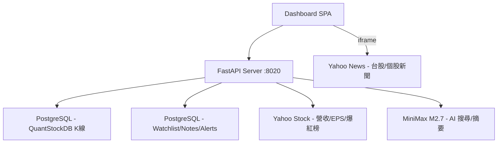

# ProTech-Stock-News Dashboard — 開發記錄

---

## 一、系統概述

個股技術分析 + 基本面 Dashboard。整合 ProTech-QuantStockDB (PostgreSQL) K 線資料，Yahoo Stock 營收/EPS/社群爆紅榜/新聞。

### 架構



### 專案結構

```
src/
├── core/
│   ├── database.py      # PostgreSQL (watchlist, notes, alerts, trades)
│   └── pg_client.py     # PostgreSQL (kline: daily/weekly/monthly)
├── services/
│   ├── yahoo_service.py    # Hot stocks + Revenue + Dividend + Rank
│   ├── semantic_search.py  # AI 搜尋 + 問答 (MiniMax M2.7)
│   ├── news_digest.py      # 週報摘要生成
│   ├── alert_engine.py     # 警示引擎
│   ├── backtest_engine.py  # 回測引擎
│   ├── realtime_quote.py   # 即時報價
│   ├── us_index_service.py # 美股指數
│   ├── image_analysis.py   # 圖片 OCR + AI 分析
│   └── telegram_service.py # Telegram 通知
├── server.py            # FastAPI
└── templates/
    └── index.html       # Dashboard SPA
```

---

## 二、已完成功能

| 功能 | 說明 |
|------|------|
| K 線圖 | 日/週/月線切換，天數可調 |
| MA 均線 | 最多 5 條自訂天數，MA 扣抵標記 |
| VOL / MACD | 互斥子圖切換 |
| 年度營收走勢 | 折線圖 |
| 歷年股利 | 柱狀圖 |
| 自選股 | 加入/移除/分組管理/▲▼ 快速切換 |
| 備註 | 獨立浮動視窗，文字+圖檔+截圖，可拖曳 |
| 警示通知 | 多條件、toast+Browser+Telegram |
| 回測 | 多條件策略模擬、K 線標記買賣點、損益統計 |
| 美股指數 | 道瓊/那斯達克/費城半導體 K 線圖 |
| 社群爆紅榜 | Yahoo 最多瀏覽/瀏覽激增/熱門搜尋 |
| 漲跌幅排行 | 上市/上櫃 漲幅/跌幅排行 |
| 個股新聞 | 外連 Yahoo News |
| AI 新聞搜尋 | MiniMax M2.7 語意搜尋 + 問答 |
| 週報摘要 | 自動生成每週新聞重點 |
| 圖片分析 | OCR + AI 辨識圖片內容 |

### API Endpoints

| Method | Path | 說明 |
|--------|------|------|
| GET | `/api/stocks` | 股票清單 |
| GET | `/api/stock/{code}/kline?period=&days=` | K 線資料 |
| GET | `/api/stock/{code}/revenue` | 年度營收 |
| GET | `/api/stock/{code}/dividend` | 歷年股利 |
| GET | `/api/hot-stocks?type=` | 社群爆紅榜 |
| GET | `/api/rank?direction=&market=` | 漲跌幅排行 |
| GET | `/api/watchlist` | 自選股清單 |
| POST | `/api/watchlist/{code}?name=` | 加入自選 |
| DELETE | `/api/watchlist/{code}` | 移除自選 |
| GET | `/api/alerts` | 警示條件列表 |
| POST | `/api/alerts` | 新增警示 |
| PUT | `/api/alerts/{id}` | 修改警示 |
| DELETE | `/api/alerts/{id}` | 刪除警示 |
| GET | `/api/alerts/settings` | 警示全域設定 |
| PUT | `/api/alerts/settings` | 更新警示設定 |
| POST | `/api/backtest` | 執行回測 |
| GET | `/api/usindex/{symbol}/kline?period=&days=` | 美股指數 K 線 |
| GET | `/api/notes/ask?q=` | AI 新聞問答 |
| GET | `/api/notes/search?q=` | AI 新聞搜尋 |

### 資料來源

- **PostgreSQL** (ProTech-QuantStockDB) — K 線、營收、獲利、自選股、交易記錄、備註、餘額、排行榜、警示、美股指數
- **Yahoo Stock** — 社群爆紅榜、漲跌幅排行
- **Yahoo Finance API** — 美股指數歷史資料
- **MiniMax M2.7** — AI 語意搜尋、新聞問答、週報摘要、圖片分析

---

## 三、待開發：AI 分析 K 線

> 討論日期：2026-07-30

### 3.1 K 線分析方案比較

| 方案 | 做法 | 優點 | 缺點 |
|------|------|------|------|
| A | 程式算指標 → 摘要送 LLM | 省 token、快、穩定 | 要寫指標邏輯 |
| B | 原始 OHLCV 直接送 LLM | 最簡單 | token 大、判斷易錯 |
| **C（✅）** | **混合：程式算指標 + 偵測型態 + LLM 綜合** | **兼顧精確與自然語言** | 開發量中等 |
| D | K 線圖渲染圖片 → 多模態 AI | 接近人類 | 費用高、模型限制 |

**決定採用方案 C（混合式）**

### 3.2 前端整合

- K 線圖區域新增「🤖 AI 技術分析」按鈕，點擊自動分析當前股票
- 分析結果自動寫入 `_conversation_history`
- 使用者可在現有「AI 搜尋」框接著追問（技術 + 新聞交叉對話）

### 3.3 分析結果儲存

- **自動存入 `watchlist_notes`**（stock_code + news_date + title:「🤖 AI 技術分析」）
- 不好的可**編輯**或**刪除**（已有 API）
- 修正後的版本成為 AI 下次的參考依據

### 3.4 「訓練」AI 方案與優先順序

| 優先級 | 方案 | 說明 | 難度 | 效果 |
|--------|------|------|------|------|
| 🥇 | 累積 + 編輯 | 歷史分析存 DB，使用者修正，AI 參考修正版 | 低 | 高 |
| 🥈 | 個人風格 Prompt | 使用者設定偏好（順勢/逆勢、指標權重、停損停利），自動帶入 | 低 | 中高 |
| 🥉 | 結果驗證標記 | 分析後標記 ✅/❌，prompt 帶入歷史正確率 | 中 | 高 |
| 4 | Few-shot 範例庫 | 精選優質分析作為 prompt 範例 | 中 | 中高 |
| 5 | 向量搜尋 RAG | embedding 語意搜尋 + 跨股票關聯 | 中高 | 中 |
| 6 | 多模型交叉驗證 | 多方/空方/裁判角色，正反觀點 | 低 | 中 |

### 3.5 技術實作規劃

1. 新增 `src/services/kline_analysis.py` — 技術指標計算 + K 線型態辨識
2. 新增 API：`POST /api/stock/{code}/ai-analysis?period=daily&days=120`
3. 分析結果自動存入 `watchlist_notes`
4. 分析結果同時寫入 `_conversation_history` 供追問
5. 前端 K 線圖工具列加「🤖 AI 技術分析」按鈕
6. 前端顯示分析結果，可編輯/刪除
